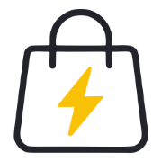

# StoreLens

[](https://vitejs.dev/)
[](https://react.dev/)
[](https://ui.shadcn.com/)
[](https://pages.cloudflare.com/)
<!-- [](https://tailwindcss.com/)
[](https://www.radix-ui.com/) -->



When a store doesn't offer decent filtering, sorting, or search, browsing becomes a chore. **StoreLens** gives you a cleaner, more powerful view of any Shopify store.

Just paste a store's domain or collection URL and StoreLens loads the full product list, complete with filtering, sorting, and search — all client-side, with no backend or API keys required.

*Live demo coming soon.*
<!-- See it in action at [storelens.ctrlalt.nz](https://storelens.ctrlalt.nz) -->


## Features

- Browse any Shopify collection (including all products)
- Auto-detect default collections from bare domains  
- Loads full pagination for complete product retrieval  
- Filter by vendor, product type, tags, variant options, price, and stock or sale status — even if the shop doesn’t show them  
- Sorting by title, price, newest first, or highest discount 
- Search across product titles and descriptions  
- URL history to quickly re-visit recent stores
- Clean UI built with Tailwind + shadcn/ui  
- 100% client-side — no API keys or server required
- Deploy-ready for Cloudflare Pages, GitHub Pages, Netlify, Vercel, or any other static file host!


## Tech Stack

- React (Vite)
- Tailwind CSS v4
- shadcn/ui + Radix UI
- JavaScript
- lucide-react icons

## Development

Assuming your environment is already configured:

```bash
npm install
npm run dev
```

## Status and Limitations

StoreLens is currently in ***early alpha*** (0.1).

Core browsing, filtering, and sorting features are functional, with a small number of enhancements planned.

StoreLens relies on Shopify’s public JSON endpoints. Stores that restrict or heavily customise their storefront data may return incomplete or inconsistent information.

**A note about very large collections:** StoreLens works by fetching every product in a collection. Extremely large catalogues may load slowly, and performance will depend on your browser and computer.

## Known Issues

- Shopify enforces a limit of 1,000 collection pages (and 250 products per page).
  Collections larger than 250,000 items cannot be fully loaded and will cause StoreLens to crash.


## License

MIT