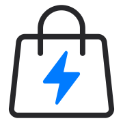

# StoreLens

[](https://vitejs.dev/)
[](https://react.dev/)
[](https://ui.shadcn.com/)
[](https://pages.cloudflare.com/)
<!-- [](https://tailwindcss.com/)
[](https://www.radix-ui.com/) -->



When a store doesn't offer decent filtering, sorting, or search, browsing becomes a chore. **StoreLens** gives you a cleaner, more powerful view of an online store's catalogue.

Just paste a store's domain or collection URL (see [Supported platforms](#supported-platforms)) and StoreLens loads the full product list, complete with filtering, sorting, and search — all client-side, with no backend or API keys required.

**Try it:** [storelens.pages.dev](https://storelens.pages.dev)


## Supported platforms

StoreLens only works with platforms that publish a keyless, browser-readable product listing, so it needs no backend, proxy or API keys.

| Platform | Status |
|---|---|
| Shopify | Supported |
| Fourthwall | Supported |
| Big Cartel | Supported (`*.bigcartel.com` shops) |

Each platform is a small adapter (`src/lib/platforms/`) that turns the platform's own listing into one neutral product shape, so the filters, sorting and search are shared. Platforms that don't allow cross-origin reads (WooCommerce, Magento, Squarespace) or need per-merchant tokens (BigCommerce, Salesforce Commerce Cloud) can't work without a backend and are out of scope.


## Features

- Browse any collection (including all products)
- Auto-detect default collections from bare domains  
- Loads full pagination for complete product retrieval  
- Filter by vendor, category, tags, variant options, price, and stock or sale status — even if the shop doesn’t show them  
- Sorting by title, price, newest first, or highest discount 
- Search across product titles and descriptions  
- Recent Stores to quickly re-visit stores you have opened
- Shareable links: the address keeps the store, collection, filters and sort, so a link reopens the same view
- A bookmarklet that opens the store you're browsing in StoreLens (see [Open a store in StoreLens](#open-a-store-in-storelens))
- Partial results with a warning if a page of products fails to load, instead of discarding what already loaded
- Clean UI built with Tailwind + shadcn/ui  
- Per-platform differences: a Fourthwall shop's collection dropdown offers "All Products", the collection in the link and the collections you have opened on that shop before (remembered in this browser, a few handles per shop), with a note saying why it can't list the rest (Fourthwall's collections can't be read from the browser, so paste a collection's link to open one); it has no vendor, type, tag or description filtering, because Fourthwall doesn't provide that data
- Per-platform differences: a Big Cartel shop's collections are its categories (a product in several categories appears in each), "Artists" replaces the vendor filter and only shows for shops that fill it in, and there is no tag filtering because Big Cartel has no tags
- 100% client-side — no API keys or server required
- Static build that needs no server. Store and collection links rely on `public/_redirects` sending every path to `index.html`, which Cloudflare Pages and Netlify read. On GitHub Pages and Vercel (which ignore that file) those links would 404 unless you add an equivalent rewrite rule


## Open a store in StoreLens

A bookmarklet opens the store or collection you're looking at in StoreLens, in a new tab. To add it, create a new bookmark in your browser and paste this as its address (URL):

```
javascript:(()=>{const p=location.pathname.replace(/\/products\/.*$/,'').replace(/\/+$/,'');window.open('https://storelens.pages.dev/'+location.host+p,'_blank')})()
```

Then click the bookmark while on a store's page. It builds the same `/{host}{path}` link StoreLens uses, so:

- On a collection page (`/collections/…`, or `/category/…` on Big Cartel) it opens that collection.
- On a product page or the store's home page it opens the store, and StoreLens loads its default collection. A locale prefix such as `/en-nzd` is kept.
- It only helps on stores StoreLens supports (see [Supported platforms](#supported-platforms)). A Big Cartel shop on its own domain can't be read, as described in [Known Issues](#big-cartel).

Some sites' security settings may block bookmarklets. If yours does, paste the store's address into StoreLens instead.

## Tech Stack

- React (Vite)
- Tailwind CSS v4
- shadcn/ui + Radix UI
- JavaScript
- lucide-react icons

## Development

Assuming your environment is already configured:

```bash
npm install
npm run dev
```

Development needs Node 22.22.2+ (22.x), 24.15+ (24.x) or 26+: that is the range the test tooling (jsdom 30) supports, so Node 23 and 25 are out. CI uses Node 22. There is no `engines` field, since it would only warn.

`npm install` also installs the git hooks in `.githooks/` (run it again after changing one). They refuse commits and merges on `main`: work on a branch (one per issue) and merge through a pull request.

Dependabot (`.github/dependabot.yml`) opens one grouped upgrade PR per month for npm packages and one for GitHub Actions, plus grouped security fixes as they come. Review and merge them like any other PR once `test` passes.

Run the tests with `npm test` (they run offline against synthetic fixtures, never real store data) and lint with `npm run lint`.

### Platform feed smoke check

The unit tests can't notice a platform changing its feed (Fourthwall's and Big Cartel's are undocumented or legacy), so a separate script checks live sample stores:

```bash
npm run smoke
```

For each sample store it requests the feed with `Origin: https://storelens.pages.dev` and checks the HTTP status, an `Access-Control-Allow-Origin` header, the response shape, that paging terminates, and that the fields the adapters read still exist. It prints a pass/fail table (about 10 seconds) and exits non-zero only if a platform has no passing store. A store that was removed, locked or emptied shows as `GONE` rather than failing, so refresh the sample lists in `scripts/smoke-platforms.config.mjs` when that happens.

It hits real stores, so it isn't part of `npm test` or CI. **Run it by hand before each release.** It reads feeds in memory only and never saves responses.

## Browser support

StoreLens needs Chrome 111+, Edge 111+, Firefox 128+ or Safari 16.4+. That is the floor of Tailwind CSS v4, which the styling is built on ([Tailwind's browser support](https://tailwindcss.com/docs/compatibility) lists Chrome 111, Safari 16.4 and Firefox 128; Edge follows Chrome's version). The JavaScript is transpiled for slightly older browsers (`build.target` in `vite.config.js`: Chrome and Edge 107, Firefox 104, Safari 16) and relies on that without fallbacks (for example `AbortSignal.throwIfAborted`), but the CSS is the higher bar. Older browsers aren't supported.

## Status and Limitations

StoreLens should be considered in ***beta*** (0.2).

Core browsing, filtering, and sorting features are functional.

StoreLens relies on each platform’s public JSON endpoints. Stores that restrict or heavily customise their storefront data may return incomplete or inconsistent information.

**A note about very large collections:** StoreLens works by fetching every product in a collection. Extremely large catalogues may load slowly, and performance will depend on your browser and computer.

## Known Issues

### Shopify

- Shopify enforces a limit of 1,000 collection pages (and 250 products per page).
  For a collection larger than 250,000 items StoreLens shows the first 250,000 products, with a warning.


### Fourthwall

- Variant options have no names in Fourthwall's feed (a variant is just a title such as "Black, XS"), so StoreLens guesses them: a size is labelled "Size" and anything else "Option 1", "Option 2"… Filtering by these names can group unrelated options, and a notice says so when it applies.
- Stock is reported per product, not per variant, so every size of a sold-out product reads as out of stock, and an in-stock product's sizes all read as available.
- StoreLens recognises a Fourthwall shop by its "All Products" collection (every shop tested has one), so a shop without it wouldn't be recognised.
- Loads stop after 2,000 products, with a warning.

### Big Cartel

- Only shops at `*.bigcartel.com` work. A shop on its own domain can't be read: its feed carries no CORS headers, and the CORS-enabled feed is looked up by the shop's Big Cartel name, which can't be worked out from the domain. StoreLens says so when it can't reach such a shop.
- StoreLens uses Big Cartel's legacy, undocumented product feed, which Big Cartel could change without notice. The documented API needs a login, so it can't be used.
- The largest shops tested had 35 products, all returned, so whether Big Cartel caps a very large shop's feed is untested.
- The products feed has no currency, so StoreLens reads the shop's from its `store.json`; if that can't be read, prices show with "$".
- The feed can't be paged, so StoreLens compares the number of products loaded with the shop's own count in `store.json` and warns when fewer loaded (a shop whose count is missing or 0 is never warned about).
- A product's sale price is only shown when the feed flags it on sale and an option costs less than the base price.
- Categories show both in the collection dropdown and as the "Category" filter.


## License

MIT